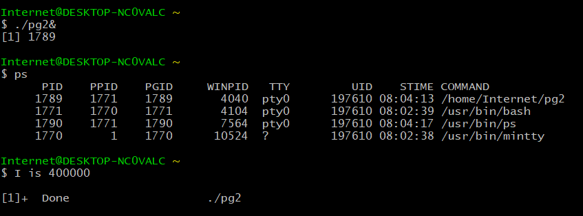
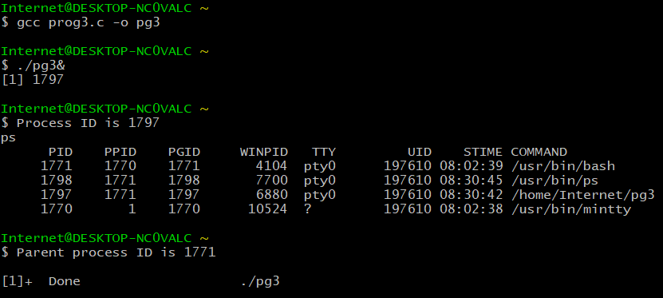
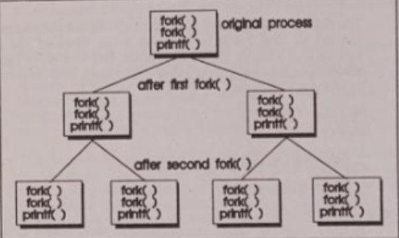
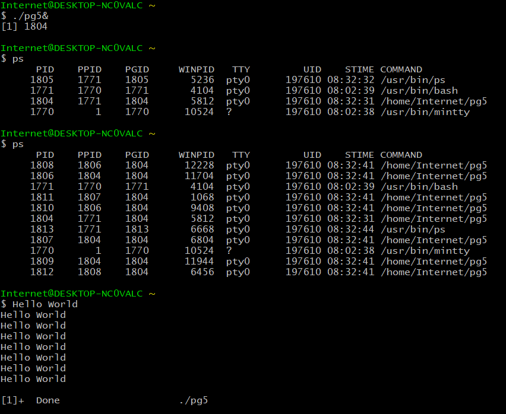
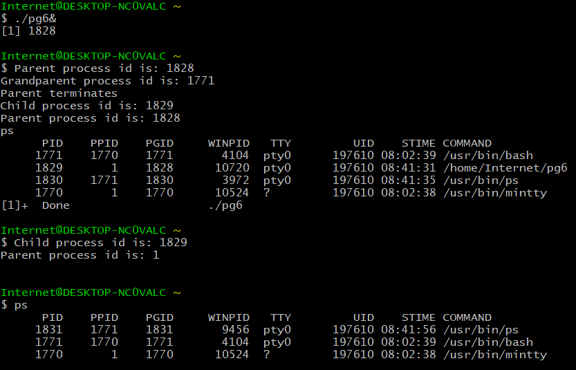

##Background Process
```c
#include <stdio.h>
#include <unistd.h>

int main()
{
  long i;

  sleep(10);
  for (i=0;i<=40000;i++);

  printf("Value of i is: %d",i);
  return 0;
}
```




##Process Identification

```c
#include <stdio.h>
#include <unistd.h>
int main ()
{
	long pid =getpid();
	pid_t ppid=getppid();

	printf("Process ID is %ld \n",pid);
	
	sleep(10);
	printf("Parent process ID is %d \n",ppid);

	return 0;
}
```



```c

#include <stdio.h>
#include <unistd.h>
int main (){
	sleep(10);
	fork();
	fork();
	fork();
	sleep(10);
	printf("Hello World\n");

	return 0;
}
```



```c
#include <stdio.h>
#include <unistd.h>
int main (){
	int pid;
	pid = fork();
	if (pid==0){
		printf("Child process id is: %d \n",getpid());
		printf("Parent process id is: %d \n",getppid());
		sleep(10);
		printf("Child process id is: %d \n",getpid());
		printf("Parent process id is: %d \n",getppid());
	}
	else {
		printf("Parent process id is: %d \n",getpid());
		printf("Grandparent process id is: %d \n",getppid());
		printf("Parent terminates\n");
	}
	return 0;
}
```



As observed from the output snippet, orphaned child processes are adopted by the shell hence its parent pid becomes 1 at the end of execution since its original parent had long since terminated.
